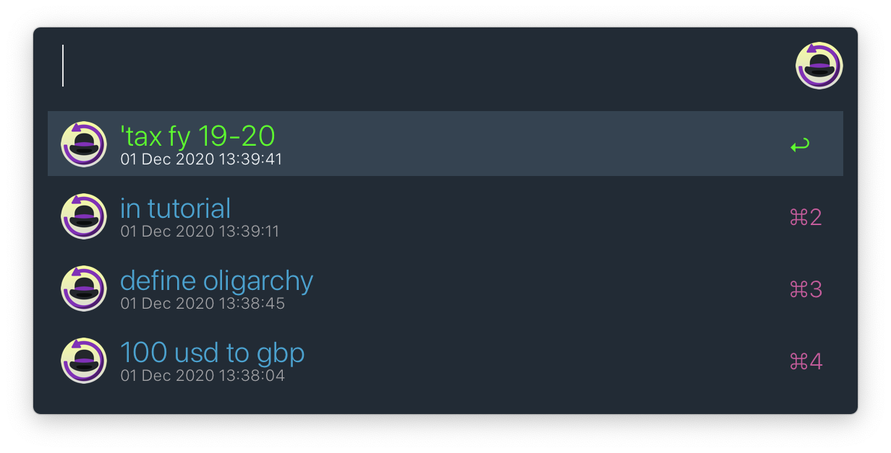
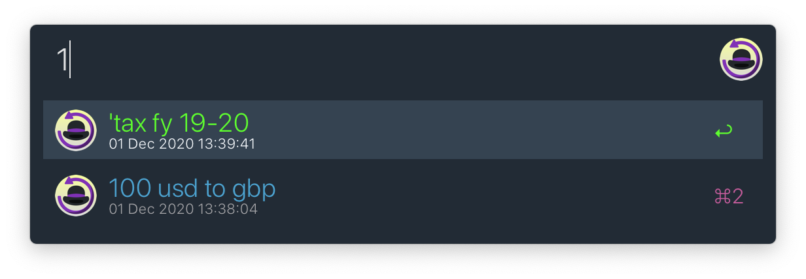

# Alfred History Search

  

An [Alfred](https://alfredapp.com) workflow to search through query history,
and execute queries from history.

## Usage
Download the [latest release][1]

#### Searching Through Query History
 - Assign hotkey trigger (`⌃R` recommended)
 - While using Alfred, press the hotkey. Alfred's query history will show up:
   
 - Start typing to search through the query history.
   
 - Actioning any of the history entries makes Alfred search that query.
   

#### Deleting Query History
Type `.clear-afred-query-history` in Alfred.

## Icon Credits
Icon created by combining icons form [flaticon](https://www.flaticon.com)
made by [Freepik](https://www.flaticon.com/authors/freepik)
and [Pixel Perfect](https://www.flaticon.com/authors/pixel-perfect)

[1]: https://github.com/mr-pennyworth/alfred-history-search/releases/latest/download/Alfred.History.Search.alfredworkflow
